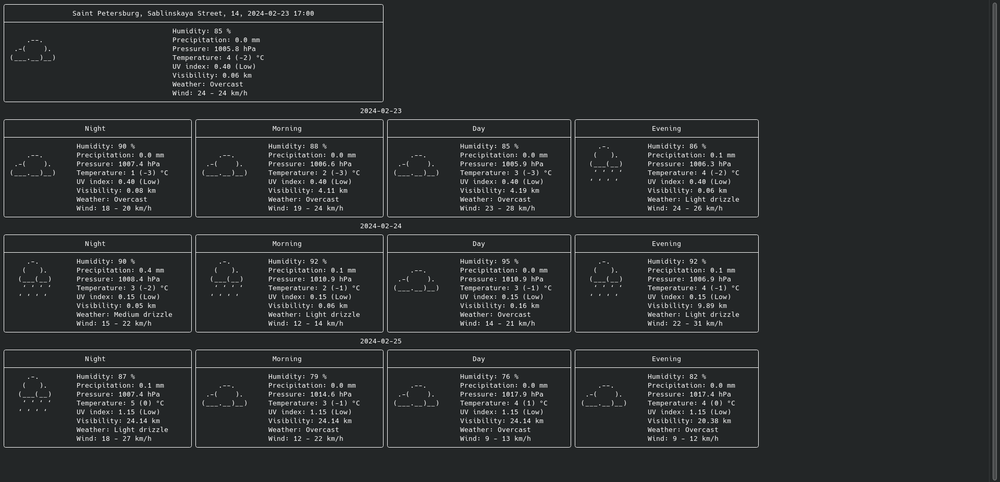

# Документация программы weather-forecast

Этот документ описывает сборку из исходного кода и использование программы
weather-forecast.

## Зависимости

Для успешной компиляции требует установленного `Git`, `CMake` и компилятора C++,
поддерживающего стандарт C++20.
Также потребуется ключ от [Yandex Geocoder API](https://yandex.ru/dev/geocode/doc/ru/).

> **Важно!**<br>
> Для ОС Windows успешная сборка и компиляция возможна **только** при
> установленном `Visual Studio 2017+`.

## Как собрать

В данном документе описана исключительно процедура сборки главного исполняемого
файла.
> Процесс сборки тестов описан не будет, его можно восстановить из
[CI/CD скрипта](../.github/workflows/ci_tests.yml).

### Автоматическая сборка и установка

Сделайте исполняемым и запустите [shell-script установки](../install.sh), затем следуйте
инструкциям.
> **Важно!**<br>
> Для ОС Windows автоматизированная сборка гарантирована только
> при запуске в Git Bash.

```shell
chmod +x ./install.sh && ./install.sh
```

### Ручная сборка

* Сначала, если Вы этого не сделали, клонируйте проект и перейдите в его каталог:

```shell
git clone https://github.com/bialger/weather-forecast.git && cd weather-forecast
```

#### Linux и MacOs

* Создайте Release-кеш CMake:

```shell
cmake -S . -B ~/CMakeBuilds/weather-forecast -DCMAKE_BUILD_TYPE=Release
```

* Соберите проект из этого кеша:

```shell
cmake --build ~/CMakeBuilds/weather-forecast --target weather-forecast
```

* Введите ключ от [Yandex Geocoder API](https://yandex.ru/dev/geocode/doc/ru/) и
  запишите его в соответсвующий файл:

```shell
read -r API_KEY && echo "$API_KEY" > "./.config/yandex_api_key.apikey"
```

* Скопируйте в конфигурационный каталог файлы конфигурации:

```shell
cp -r ./.config ~/.config/weather-forecast
```

* Создайте символьную ссылку на исполняемый файл (~/weather-forecast.run):

```shell
ln -s ~/CMakeBuilds/weather-forecast/bin/weather-forecast ~/weather-forecast.run
```

#### Windows

* Создайте Release-кеш CMake:

```shell
cmake -S . -B "%userprofile%\CMakeBuilds\weather-forecast" -DCMAKE_BUILD_TYPE=Release
```

* Соберите проект из этого кеша:

```shell
cmake --build "%userprofile%\CMakeBuilds\weather-forecast" --target weather-forecast
```

* Введите ключ от [Yandex Geocoder API](https://yandex.ru/dev/geocode/doc/ru/) и
  запишите его в соответсвующий файл:

```shell
SET /P API_KEY="Enter your Yandex Geocoder API key: " && echo %API_KEY% > ".config\yandex_api_key.apikey"
```

* Скопируйте в конфигурационный каталог файлы конфигурации:

```shell
xcopy /si .config "%userprofile%\.config\weather-forecast"
```

* Создайте символьную ссылку на исполняемый файл (HOME/weather-forecast.exe).
  Выполнение этой команды требует привилегий администратора.

```shell
mklink "%userprofile%\weather-forecast.exe" "%userprofile%\CMakeBuilds\weather-forecast\Debug\weather-forecast.exe"
```

## Использование

Программа weather-forecast - консольное приложение для просмотра погоды.
Предусмотрен показ погоды для локаций, перечисленных в конфигурационном файле, на
текущий момент, а также на утро, день, вечер и ночь некоторого количества дней.
Программа в один момент времени отображает непосредственно прогноз на три дня, для
просмотра прочих следует использовать навигации. В случае отсутствия 
Интернет-соединения программа запустится, однако не будет отображать актуальную 
информацию. Для получения актуальных данных возобновите подключение и обновите 
данные в программе.

> Поскольку программа использует
[Yandex Geocoder API](https://yandex.ru/dev/geocode/doc/ru/), для работы
> требуется валидный API-ключ.
> Бесплатная версия поддерживает 1000 запросов в сутки.

### Пример интерфейса



### Вызов

Программа может быть вызвана без аргументов - будут применены значения по умолчанию.
Порядок аргументов не имеет значения.

#### Аргументы командной строки:

* `-l` или `--location` - строка с названием первой локации, для которой будет
  предоставлен прогноз погоды. Если аргумент не указан, первая локация получается
  из конфигурационного файла.
* `-c` или `--config` - строка с именем файла конфигурации в формате JSON.
  Значения по умолчанию получают из
  [файла конфигурации по умолчанию](../.config/default_config.json).
  Документ должен содержать строковое поле `api_key_file` с относительным путем к
  файлу, содержащему ключ к
  [Yandex Geocoder API](https://yandex.ru/dev/geocode/doc/ru/); поле `locations`,
  содержащее список локаций (строк, содержащие адрес или название города на
  английском языке) для показа погоды; поле `defaults`, содержащее следующие
  значения параметров по умолчанию:
  * `interval` - как аргумент `--interval`.
  * `days_count` - как аргумент `--days-count`
  * `location_index` - целое неотрицательное число, являющееся индексом локации
    по умолчанию из списка `locations`. Строго меньше количества локаций.
* `-L` или `--log-file` - строка с именем файла для записи логов. Имя файла должно
  быть валидным, в частности, не являться именем каталога. Если параметр не указан,
  логи выводятся в стандартный поток вывода.
* `-d` или `--days-count` - целое положительное число, определяющее количество дней
  прогноза, отображаемых при запуске программы. Не может превышать 15. Если аргумент
  не указан, частота обновления получается из конфигурационного файла.
* `-i` или `--interval` - целое положительное число, определяющее частоту
  обновлений в часах. Не может превышать 48. Если аргумент не указан, частота
  обновления получается из конфигурационного файла.
* `-v` или `--verbose` - флаг, при истинности которого происходит вывод логов работы
  программы.
* `-h` или `--help` - флаг, при истинности которого вместо выполнения программы 
  происходит вывод справки и завершение работы.

### Использование

Навигация в программе происходит с помощью нажатий клавиш.

#### Список управляющих клавиш

* `Esc` или `q` - выход из программы.
* `F5` или `r` - обновление данных.
* `+` - увеличение количества отображаемых дней на единицу, но не более 15.
* `-` - уменьшение количества отображаемых дней на единицу, но не менее 3.
  При этом в том случае, если фокус направлен на последни день, происходит
  смещение фокуса вверх.
* `w` или `ArrowUp` - смещение фокуса отображения вверх (меньшая дата) на единицу.
* `s` или `ArrowDown` - смещение фокуса отображения вверх (меньшая дата) на единицу.
* `n`, `d` или `ArrowRight` - переход к следующей локации из списка. При достижении
  конца списка следующим считается первый элемент.
* `p`, `a` или `ArrowLeft` - переход к предыдущей локации из списка. При достижении
  начала списка следующим считается последний элемент.
