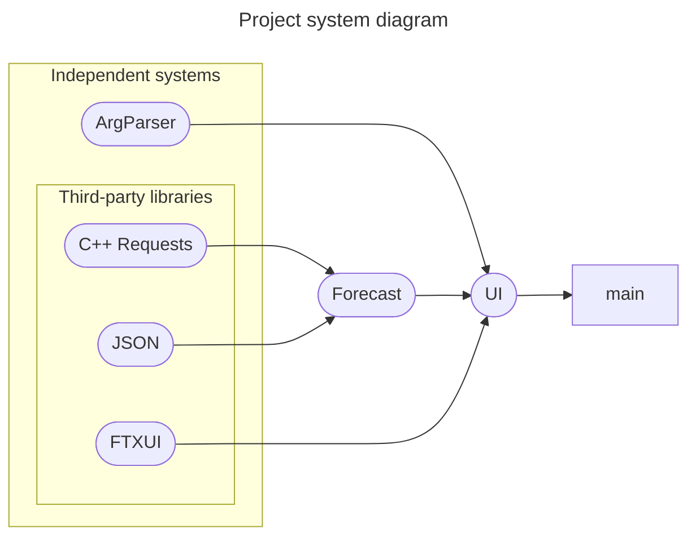
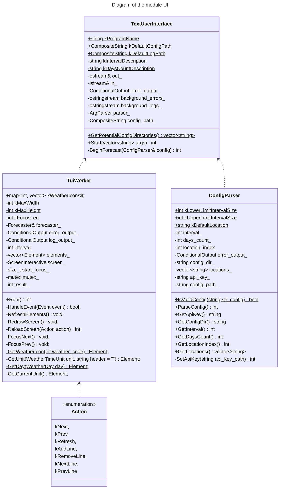
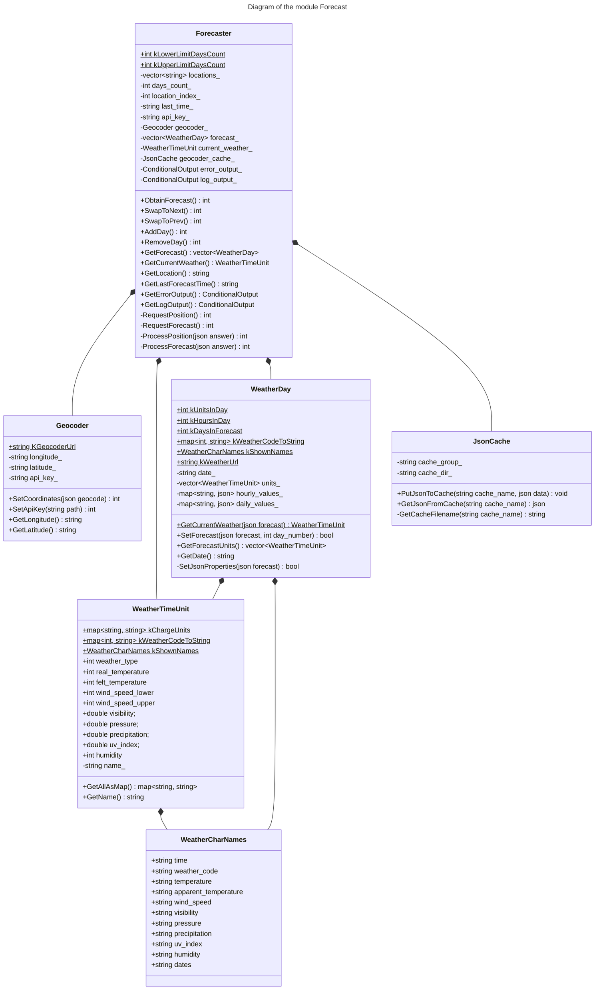
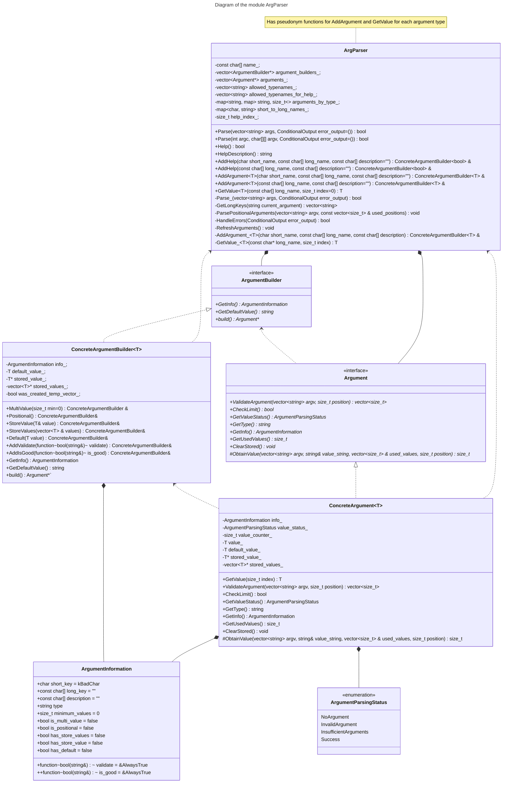

# Архитектура продукта

В этом документе описывается архитектура продукта - парсера аргументов командной
строки, разработанная на основании [требований](requirements.md).

## Системная архитектура

Продукт состоит из нескольких связанных подсистем. Несколько из них - внешние
библиотеки.

* Используется модуль UI для взаимодействия с пользовательским вводом любого рода и
  вывода информации.
* Используется модуль [ArgParser](../../lib/argparser/docs/README.md) - подсистема
  для обработки аргументов командной строки.
* Используется модуль Forecast для выполнения и обработки запросов прогноза.
* Используется библиотека [C++ Requests](https://github.com/libcpr/cpr) для выполнения HTTP-запросов.
* Используется библиотека [nlohmann_json](https://github.com/nlohmann/json) для
  обработки JSON-файлов
* Используется библиотека [FTXUI](https://github.com/ArthurSonzogni/FTXUI) для
  работы с TUI, включая пользовательский ввод.

#### UML-диаграмма

## Архитектура подсистем

Архитектура внешних подсистем лежит вне области рассмотрения данного документа.

### Архитектура подсистемы "UI"

Эта подсистема представляет собой набор классов и связей между ними для любого рода 
взаимодействия с пользователем: от аргументов командной строки до вывода результата.

#### UML-диаграмма

#### Класс TextUserInterface

Этот класс является основным классом модуля. Должен определять способ вывода ошибок и
то, как обрабатываются аргументы командной строки. Должен содержать метод запуска 
пользовательского интерфейса. Должен выводить ошибки и логи, если они требуются. 
Непосредственно взаимодействует с модулем ArgParser.

#### Класс TuiWorker

Этот класс является представлением текстового интерфейса программы. Должен содержать
метод запуска и все необходимые методы для работы TUI, включая реакцию на 
пользовательский ввод. Должен выводить ошибки и логи, если они требуются. 
Непосредственно взаимодействует с модулем Forecast.

#### Класс ConfigParser

Этот класс является представлением конфигурационного файла и его парсера. Он должен
содержать метод парсинга указанного конфигурационного файла и все прочие необходимые 
методы. Также должен иметь методы возврата полученных значений. Должен выводить ошибки.

### Архитектура подсистемы "Forecast"

Эта подсистема представляет собой набор классов и связей между ними, которые выполняют
поиск прогноза погоды с данными параметрами, и передают назад обработанные результаты
для показа пользователю.

#### UML-диаграмма

#### Класс Forecaster

Этот класс является основным классом модуля. Должен выводить ошибки и логи, если они 
требуются. Должен содержать методы запросов к 
[Yandex Geocoder API](https://yandex.ru/dev/geocode/doc/ru/) и
[Open Meteo API](https://open-meteo.com/en/docs#latitude=59.94&longitude=30.31&hourly=temperature_2m&forecast_days=16),
метод получения результата по дням, а также методы навигации по дням и локациям. 
Результат хотя бы некоторых запросов должен быть кеширован.

#### Класс JsonCache

Этот класс является абстракцией для представления кешированного результата запроса к
API в формате JSON. Должен содержать методы для кеширования и получения из кэша
запроса по имени.

#### Класс Geocoder

Этот класс представляет собой набор данных для геокодирования. Должен содержать 
информацию для выполнения запроса и его результат. Должен содержать методы для 
обработки конфигурационных файлов и ответов. Не обязан иметь метод для 
Internet-запроса.

#### Класс WeatherDay

Этот класс является абстракцией для представления погоды за день. Должен содержать
методы для обработки погоды за каждый наименьший временной промежуток и метод 
получения результатов.

#### Класс WeatherTimeUnit

Этот класс является абстракцией для представления погоды за наименьший временной 
промежуток: время суток. Должен иметь публичные поля для всех характеристик и метод,
универсально возвращающий их всех.

### Архитектура подсистемы "ArgParser"

Эта подсистема представляет собой набор классов и связей между ними, которые выполняют
непосредственно парсинг аргументов командной строки, передаваемых в подсистему. Все
классы находятся в пространстве имён ArgumentParser.

#### UML-диаграмма

#### Класс ArgParser

Этот класс является основным классом модуля, именно с ним обычно взаимодействует
пользователь. Он должен предоставлять следующие возможности: добавление обрабатываемого
аргумента (любого из указанных) с указанным ключом, парсинг набора аргументов командной
строки, а также функция добавления аргумента. Кроме того, должен иметь функцию
составления справки и обрабатывать ошибки в синтаксисе аргументов командной строки,
и, в некоторых случаях, выводить их.

#### Класс ArgumentBuilder

Этот класс реализует паттерн проектирования "Builder": ссылки на объекты наследников
этого класса должна возвращать функция добавления аргумента из ArgParser, к нему
должен обращаться пользователь, добавляя информацию об аргументе. Должен
реализовывать функции добавления любой информации про аргумент, представленные в
[тестах](../../tests/argparser_unit_tests.cpp) и функцию построения. Ему должен
наследовать шаблонизированный класс конкретного Builder, который будет реализовывать
вышеуказанный функционал для каждого из типов аргумента.

#### Класс Argument

Этот класс является родительским классом для всех классов аргументов. Должен иметь
функции возврата статуса парсинга и возврата информации об аргументе, а также функцию
получения значения аргумента из аргументов командной строки. Необходимая информация,
не изменяемая в процессе парсинга, должна храниться в виде экземпляра структуры.
На данный момент планируется аргументы всех базовых значащих типов (кроме 8-битных
чисел), StringArgument и ComplexArgument (строка с валидацией и чтением пробелов).
